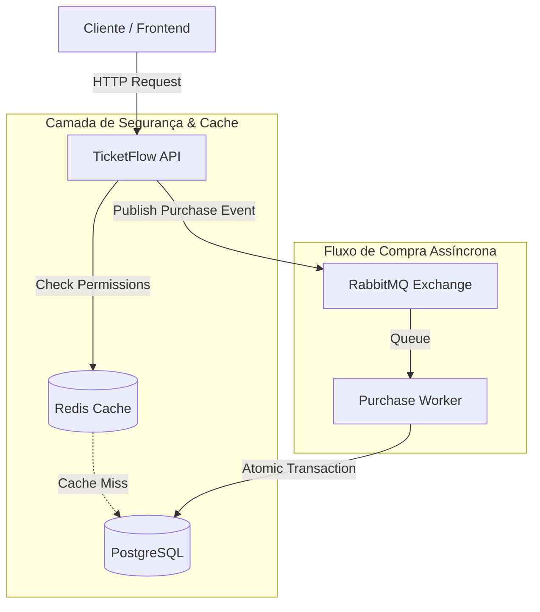

# 🎫 TicketFlow API


**TicketFlow** é uma API robusta de gestão de eventos e venda de ingressos projetada para suportar cenários de **alta concorrência**. O sistema utiliza processamento assíncrono para garantir a integridade das transações e estratégias de cache para otimizar a latência.

---

## 🏗️ Arquitetura e Design do Sistema

O sistema foi desenhado para evitar *Race Conditions* (condições de corrida) e *Database Locks* durante picos de acesso (ex: abertura de vendas de um show concorrido).



## 🚀 Destaques de Engenharia

#### 1. Processamento Assíncrono com RabbitMQ
Para evitar sobrecarga no banco de dados durante o checkout:
* A requisição de compra não grava diretamente no banco.
* O pedido é enviado para uma fila (ticket.purchase.queue).
* Workers consomem a fila garantindo que o estoque seja decrementado atomicamente e sem conflitos.

#### 2. Cache Estratégico com Redis
* Segurança (RBAC): As permissões de usuários (Roles) são cacheadas (userId_orgId) para evitar round-trips desnecessários ao banco a cada requisição autenticada.
* Serialização Customizada: Implementação de Serializers Jackson customizados para suportar Java Records e evitar problemas de LazyInitialization do Hibernate no Cache.
* Flush Strategy: Uso de @CacheEvict(allEntries = true) para garantir consistência em listas paginadas de eventos.

#### 3. Auditoria e Segurança
* JPA Auditing: Rastreamento automático de CreatedBy, CreatedDate, LastModifiedBy e LastModifiedDate em entidades críticas (Eventos, Ingressos, Tipos de Ingressos, Membros, Organizações e Usuários).
* Security Guards: Validação hierárquica de permissões por Organização.

## 🛠️ Tecnologias utilizadas
* Linguagem: Java 21
* Framework: Spring Boot 3 (Web, Data JPA, Security, AMQP, Data Redis)
* Banco de Dados: PostgreSQL
* Cache: Redis (com TTL e Custom Serialization)
* Mensageria: RabbitMQ
* Ferramentas: Docker, Docker Compose, MapStruct, Lombok.

## ⚡ Como rodar o projeto
#### Pré-requisitos
* Docker e Docker Compose instalados.
* Java 21 (apenas para desenvolvimento local sem Docker).

#### Passo a Passo

1. Clone o repositório
```
git clone [https://github.com/seu-usuario/ticketflow-api.git](https://github.com/seu-usuario/ticketflow-api.git)
cd ticketflow-api
```

2. Suba a infraestrutura (Banco, Redis, RabbitMQ) O projeto conta com um `docker-compose.yml` completo.
```
docker-compose up -d
```

3. Execute a aplicação

```
./mvnw spring-boot:run
```

A API estará disponível em: `http://localhost:8080`

## 🔌 Documentação da API

#### 🔑 Legenda de Permissões (RBAC)

| Ícone | Nível | Descrição |
| :---: | :--- | :--- |
| 🔓 | **Public** | Acesso público (qualquer pessoa). |
| 🔒 | **Auth** | Requer autenticação (Token Bearer). |
| 🏢 | **Org Staff** | Requer ser membro da organização (STAFF, ADMIN ou OWNER). |
| 🛠️ | **Org Admin** | Requer permissão de administrador na organização (ADMIN ou OWNER). |
| 👑 | **Org Owner** | Requer ser o dono da organização (OWNER). |

---

#### 1. AuthController
Gerenciamento de autenticação e sessão do usuário.

| Método | Rota | RBAC | Descrição | Retorno |
| :--- | :--- | :---: | :--- | :--- |
| `POST` | `/api/auth/register` | 🔓 | Registra um novo usuário na plataforma. | `201 Created` <br> `UserDetailResponse` |
| `POST` | `/api/auth/login` | 🔓 | Realiza login com email e senha. | `200 OK` <br> `TokenResponse` |
| `POST` | `/api/auth/google` | 🔓 | Realiza login/registro via Google. | `200 OK` <br> `TokenResponse` |
| `GET` | `/api/auth/me` | 🔒 | Obtém os dados do usuário autenticado. | `200 OK` <br> `UserDetailResponse` |
| `POST` | `/api/auth/refresh` | 🔓 | Atualiza o token de acesso (Refresh Token). | `200 OK` <br> `TokenResponse` |

#### 2. EventManagementController
Gestão administrativa de eventos dentro de uma organização.

| Método | Rota | RBAC | Descrição | Retorno |
| :--- | :--- | :---: | :--- | :--- |
| `POST` | `/api/organizations/{orgId}/events` | 🛠️ | Cria um novo evento na organização. | `201 Created` <br> `EventDetailResponse` |
| `GET` | `/api/organizations/{orgId}/events` | 🏢 | Lista eventos da organização (visão interna). | `200 OK` <br> `List<EventSummaryResponse>` |
| `PUT` | `/api/organizations/{orgId}/events/{eventId}` | 🛠️ | Atualiza dados completos de um evento. | `200 OK` <br> `EventDetailResponse` |
| `PATCH` | `/api/organizations/{orgId}/events/{eventId}/status` | 🛠️ | Atualiza o status do evento (ex: PUBLICADO). | `200 OK` <br> `EventDetailResponse` |
| `GET` | `/api/organizations/{orgId}/events/{eventId}/dashboard` | 🛠️ | Obtém métricas e estatísticas do evento. | `200 OK` <br> `EventDashboardResponse` |

#### 3. EventStoreController
Vitrine de eventos (visão do comprador/usuário final).

| Método | Rota | RBAC | Descrição | Retorno |
| :--- | :--- | :---: | :--- | :--- |
| `GET` | `/api/events` | 🔓 | Lista/Busca eventos públicos (com filtros). | `200 OK` <br> `List<EventSummaryResponse>` |
| `GET` | `/api/events/{eventId}` | 🔓 | Detalhes públicos de um evento específico. | `200 OK` <br> `EventDetailResponse` |
| `GET` | `/api/events/purchased` | 🔒 | Lista eventos que o usuário comprou ingresso. | `200 OK` <br> `List<EventSummaryResponse>` |

#### 4. MemberController
Gestão de membros dentro de uma organização.

| Método | Rota | RBAC | Descrição | Retorno |
| :--- | :--- | :---: | :--- | :--- |
| `GET` | `/api/organizations/{orgId}/members` | 🛠️ | Lista todos os membros da organização. | `200 OK` <br> `List<MemberResponse>` |
| `POST` | `/api/organizations/{orgId}/members` | 🛠️ | Adiciona um novo membro à organização. | `201 Created` <br> `MemberResponse` |
| `DELETE` | `/api/organizations/{orgId}/members/{userId}` | 👑 | Remove um membro da organização. | `204 No Content` |

#### 5. OrganizationController
Criação e gestão da entidade Organização.

| Método | Rota | RBAC | Descrição | Retorno |
| :--- | :--- | :---: | :--- | :--- |
| `POST` | `/api/organizations` | 🔒 | Cria uma nova organização. | `201 Created` <br> `OrganizationDetailResponse` |
| `GET` | `/api/organizations` | 🔒 | Lista organizações onde o usuário é membro. | `200 OK` <br> `List<OrganizationSummaryResponse>` |
| `GET` | `/api/organizations/{orgId}` | 🏢 | Detalhes de uma organização específica. | `200 OK` <br> `OrganizationDetailResponse` |
| `PUT` | `/api/organizations/{orgId}` | 👑 | Atualiza dados da organização. | `200 OK` <br> `OrganizationDetailResponse` |
| `DELETE` | `/api/organizations/{orgId}` | 👑 | Deleta a organização. | `204 No Content` |

#### 6. TicketPurchaseController
Processo de compra e visualização de ingressos do usuário.

| Método | Rota | RBAC | Descrição | Retorno |
| :--- | :--- | :---: | :--- | :--- |
| `POST` | `/api/tickets/purchase` | 🔒 | Inicia solicitação de compra (Assíncrono). | `202 Accepted` <br> `String (Mensagem)` |
| `GET` | `/api/tickets` | 🔒 | Lista ingressos adquiridos pelo usuário. | `200 OK` <br> `List<TicketGroupResponse>` |

#### 7. TicketTypeManagementController
Configuração dos tipos de ingressos (Lotes) de um evento.

| Método | Rota | RBAC | Descrição | Retorno |
| :--- | :--- | :---: | :--- | :--- |
| `POST` | `/api/organizations/{orgId}/events/{eventId}/tickets` | 🛠️ | Cria um novo tipo de ingresso para o evento. | `201 Created` <br> `TicketTypeAdminResponse` |

## 🤝 Contribuição
Contribuições são bem-vindas! Sinta-se à vontade para abrir **Issues** ou enviar **Pull Requests**.
---

**Desenvolvido por [Marcos Allan](https://www.linkedin.com/in/omarcosallan)**
